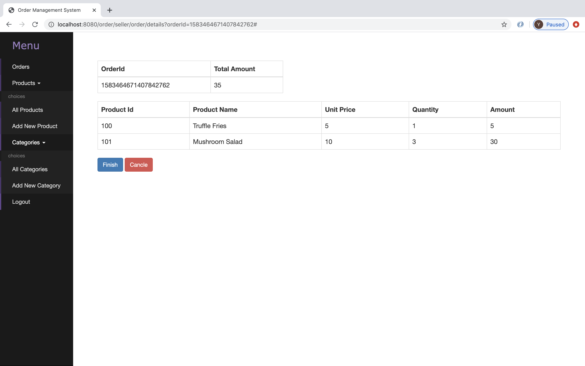

# Restaurant Order Management System

This order management system can give merchants a one-stop shop to view and manage all customer orders in one place.

Technically speaking, this is a Java SpringBoot project which supports the entire ecommerce journey of a customer order including order placement, payment process, inventory deduction, product modification and combined with FreeMarker templates to build an admin management system. 

- 【[SpringBoot](https://spring.io/projects/spring-boot)】Java Framework
- 【[MySql](https://www.mysql.com) + [JPA](https://spring.io/projects/spring-data-jpa)】Database & ORM
- 【[Redis](https://redis.io)】Distributed Session & Redis Lock
- 【[Websocket](https://developer.mozilla.org/en-US/docs/Web/API/WebSockets_API)】Real-time Data Transfer
- 【[Bootstrap](https://getbootstrap.com) + [FreeMarker](https://freemarker.apache.org) + [jQuery](https://jquery.com)】UI Construction

-----------------------------------------------------------------------------

#### Merchant service
Provide merchants with visibility into the entire process

Method	| Path 	| Parameter 	| Description	| User authenticated	| Available from UI
------------- | ------------ | ------------ | ------------- |:-------------:|:----------------:|
POST	| /seller/user/register | sellerInfo |  Regitster as an user	| × | ✓	
GET	| /seller/user/start	| * | Direct to login page 	| ×  | ✓
GET	| /seller/user/login	| username, password | Login as an user 	| ×  | ✓
GET	| /seller/user/logout	| * | Logout 	| ✓  | ✓

Method	| Path 	| Parameter 	| Description	| User authenticated	| Available from UI
------------- | ------------ | ------------ | ------------- |:-------------:|:----------------:|
GET	| /seller/order/list | * |  Get all order information	| ✓ | ✓	
GET	| /seller/order/detail	| orderId | Get details of a certain order 	| ✓  | ✓
GET	| /seller/order/cancel	| orderId | Cancel a certain order 	| ✓  | ✓
GET	| /seller/order/finish	| orderId | Complete a certain order 	| ✓  | ✓
GET	| /buyer/order/detail	| userId, orderId | Get a certain order information  	| ✓  | ✓
POST	| /buyer/order/cancel	| userId, orderId | Cancel a certain order 	| ✓  | ✓

Method	| Path 	| Parameter 	| Description	| User authenticated	| Available from UI
------------- | ------------ | ------------ | ------------- |:-------------:|:----------------:|
GET	| /seller/product/list | * |  Get all product information	| ✓ | ✓	
GET	| /seller/product/putOn	| productId | Put a certain product on the shelf 	| ✓  | ✓
GET	| /seller/product/putOff	| productId | Remove a certain product 	| ✓  | ✓
GET	| /seller/product/revise	| productId | Revise a certain product information 	| ✓  | ✓
POST	| /seller/product/save	| productForm | Create a new product 	| ✓  | ✓

Method	| Path 	| Parameter 	| Description	| User authenticated	| Available from UI
------------- | ------------ | ------------ | ------------- |:-------------:|:----------------:|
GET	| /seller/category/list | * |  Get all product category information	| ✓ | ✓	
GET	| /seller/category/revise	| categoryId | Revise a certain category information 	| ✓  | ✓
POST	| /seller/category/save	| categoryForm | Create a new product category 	| ✓  | ✓

-----------------------------------------------------------------------------

#### Customer service
Provide customers to browse product information and place orders

Method	| Path 	| Parameter 	| Description	| User authenticated	| Available from UI
------------- | ------------ | ------------ | ------------- |:-------------:|:----------------:|
POST	| /buyer/order/create | orderForm |  Create a new order	| ✓ | ×	
GET	| /buyer/order/list	| userId | Get all order information according to the certain accout 	| ✓  | ×
GET	| /buyer/order/detail	| userId, orderId | Get certain order information  	| ✓  | ×
POST	| /buyer/order/cancel	| userId, orderId | Cancel certain order 	| ✓  | ×
GET	| /buyer/product/list	| userId | Read all products information 	| ✓  | ×

-----------------------------------------------------------------------------

# Preview

-----------------------------------------------------------------------------

## Contributions are welcome!

Feel free to suggest and implement improvements.

yujiafan10@gmail.com

